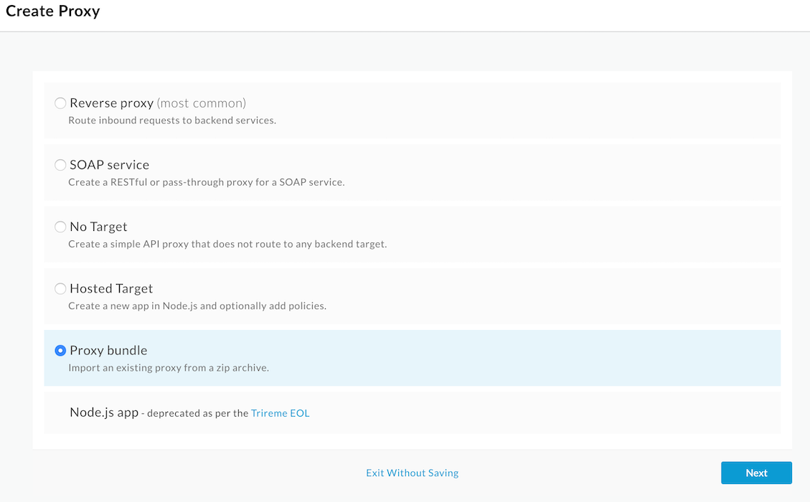
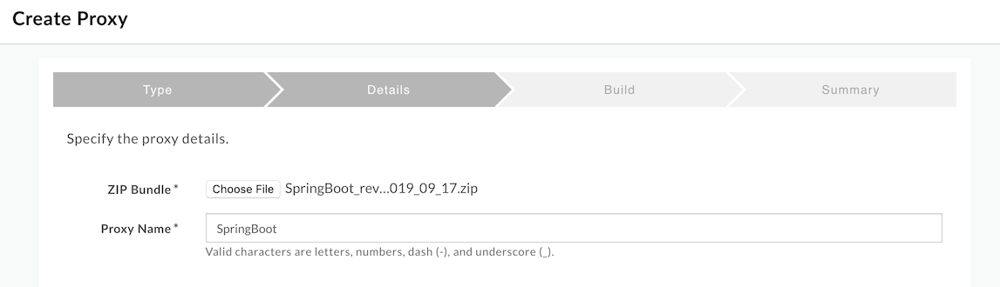
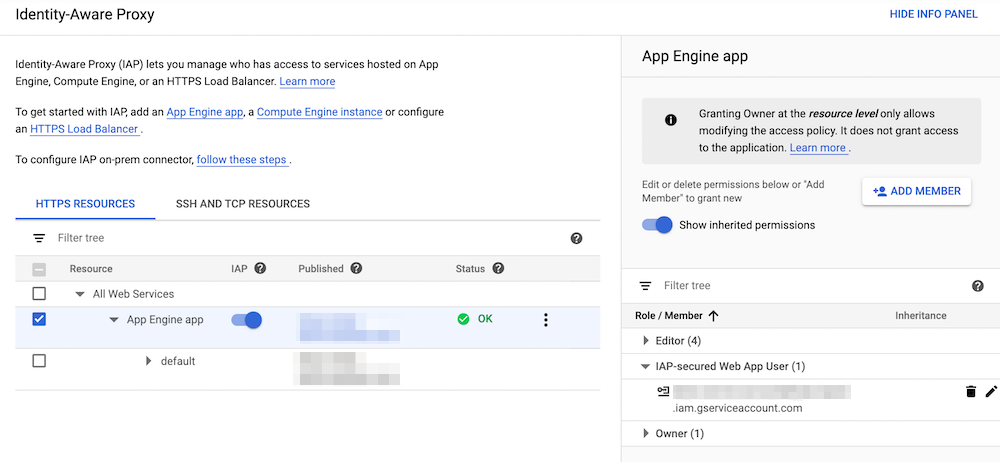
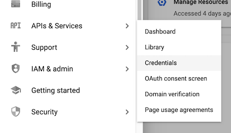
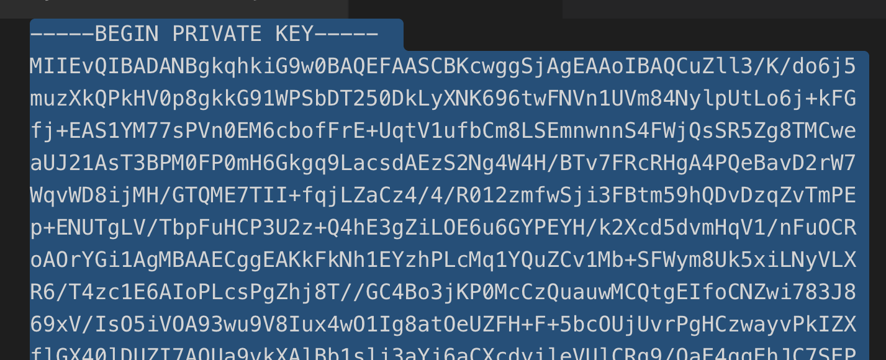
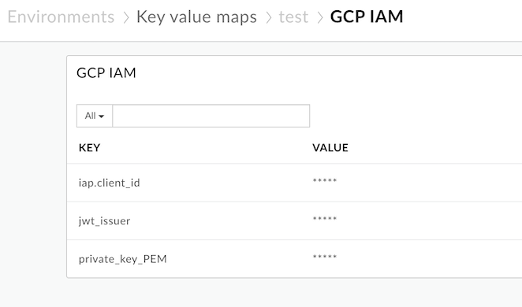
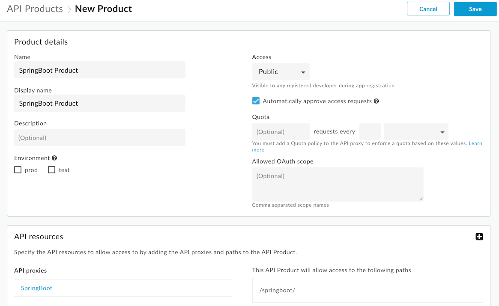
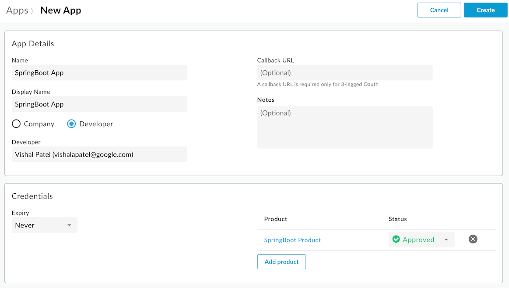
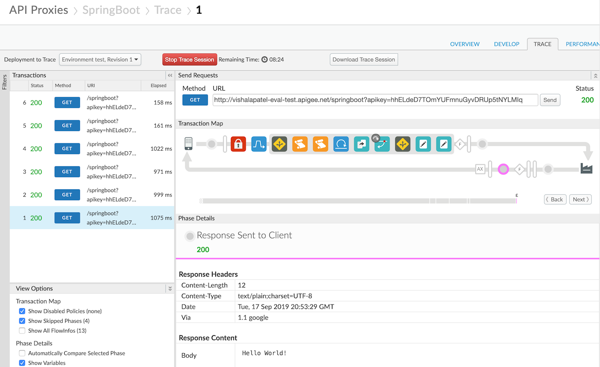

# SpringBootAppEngineFlex
Google Cloud Platform (GCP) provides services such as App Engine and Google Kubernetes Engine (GKE) that allow developers and architects to easily create APIs publicly. However, there are times when the APIs and services made available should not be publicly accessible. To avoid such a scenario, Googe Cloud Identity Aware Proxy (IAP) can be enabled to challenge calling client applications making requests to services such as App Engine or GKE for authenticated credentials before allowing access to protected resources.

In addition, companies may want to incorporate services exposed by GCP as part of an API management program to allow first party and third party developers to easily sign up for a developer account, register for an API key, browse a catalog of available APIs and corresponding documentation and begin consuming APIs.  The use of the Apigee Edge platform in conjunction with Google Cloud Identity Aware Proxy can facilitate secured, service to service communication to APIs deployed to App Engine or other GCP resources i.e. GKE or Compute Engine.

This repo contains a sample App Engine Flex SpringBoot application and a sample Apigee Edge proxy.  The sample proxy leverages a Shared Flow to enable authentication with Google Cloud Identity using a GCP Service Account. It does this by adding an audience claim to a JSON Web Token (JWT) minted by Apigee thats leveraged to authenticate with Google Cloud Identity. The token is passed as a Bearer token in the Authorization header sent to the endpoint protected by IAP.  The service account used in this context has the role "IAP-securedWebAppUser" which is required to allow access to web resources protected by IAP.  

You can read more about how to use an OpenID Connect (OIDC) token to authenticate a service account to a Cloud IAP-secured resource at the link below:  
https://cloud.google.com/iap/docs/authentication-howto#authenticating_from_a_service_account

The flow of authentication calls is documented at the link here (See HTTP/REST tab): 
https://developers.google.com/identity/protocols/OAuth2ServiceAccount#authorizingrequests

Note that in this example the Apigee Edge platform is leveraged to mint a JWT token rather than writing boilerplate code i.e. it adds the required audience and issuer claims to a JWT, references the private key of the service account created in GCP and generates the JWT to pass to Cloud Identity to authenticate.  Once Cloud Identity sends a valid JWT back to Apigee, it adds that token to the outbound call to the IAP protected resource as an Authorization header (as a Bearer token).

Let's get started.

### Create the Apigee Edge proxy and shared flow
You will need access to an Apigee account to create the proxy and shared flow needed to follow this example. If you don't have an account you can sign up for a free trial using the link below. 

##### Sign-up for an Apigee Edge trial account
Visit the following page to create a free trial Apigee account: https://login.apigee.com/sign_up

### Import the proxy bundle
For the following steps, please log in to your Apigee Edge account.
2. Navigate to `Develop > API Proxies` in the left menu.
3. Click the `+Proxy` button in the top right hand corner of the screen.
4. Select `Proxy bundle` and click `Next`.

5. For `Zip Bundle:`, Select the `SpringBoot_rev1_2019_09_17.zip` zip archive.
6. Set `Proxy Name:` to `SpringBoot` and click `Next`.

7. Click `Build`.

### Import the shared flow bundle
1. Navigate to `Develop > Shared Flows` in the left menu.
2. Click the `+Shared Flow` button in the top right hand corner of the screen and select `Upload bundle...` from the drop down.
3. Select the `GCP-Auth_rev3_2019_09_17.zip` zip archive.
4. Set the `Name:` to `GCP-Auth` and select `Create`.

### Deploy the SpringBoot App Engine Flex application
The instructions for deploying the SpringBoot application can be found in the README file of the [`helloworld-springboot`](helloworld-springboot) directory. Please follow the steps in the README to deploy the App Engine Flex application and return to the steps below once complete.

## Configuring GCP Resources
The purpose of this example is to show you how you can leverage a service account created in GCP to enable service to service authentication when Apigee Edge is the calling client and the SpringBoot application we previously deployed to App Engine Flex is the IAP protected resource. 

To facilitate this, we will configure Identity Aware Proxy (IAP) to allow the service account we create access to the resources our App Engine Flex application makes available by requiring calling clients to provide an authenticated Identity in the form of a JSON Web Token (JWT). Only members of the GCP project with an IAM role of `IAP-secured Web App User` will be allowed to access IAP's protected resources. In the next section, we will create a Service Account and configure Identity Aware Proxy.

### Create a Google Cloud Platform Service Account
Follow the instructions on the GCP documentation site to create a service account below:  
https://cloud.google.com/iam/docs/creating-managing-service-accounts#creating

When completed download the service account key in JSON format to reference the private certificate for the account in the Key Value Map we create later in this lab.

### Enable and configure Google Cloud Identity Aware Proxy (IAP)
To enable Identity Aware Proxy (IAP), perform the following steps in the GCP console:

1. Navigate to `Security > Identity-Aware Proxy` in the left navigation menu.
2. You should see the App Engine application you previously deployed earlier in this lab. Enable IAP on the application by clicking on the slider next to the application name.

3. After selecting the checkbox next to the application you would like to protect with IAP, hit the `Show Info Panel` link in the top right of the page.
4. Click the `Add Member` button and do a search for the service account you created two steps prior.
5. Add the role `IAP-securedWebAppUser` to the service account and click `Save`.

### Configure OAuth consent screen
Follow the instructions on the GCP documentation site to create an OAuth consent screen to be used with your application deployed to App Engine Flex:  
https://support.google.com/cloud/answer/6158849?hl=en

### Create a Key Value Map
The shared flow imported leverages a Key Value Map (KVM) to lookup values associated with your GCP project.  We will create a KVM in the following steps and set values for the service account and OAuth Client Credentials we will require for this example.

1. Navigate to `Admin > Environments > Key Value Maps` in the left menu.
2. Click the `+Key value map` in the top right corner of the screen.
3. Enter `GCP IAM` as the `Name` and select the `Encrypted` checkbox.
4. Once created, select the `GCP IAM` key value map by clicking on it.
5. In the `GCP IAM` key value map screen enter in the following key/values. You will need to click on the `+` icon in the top right of the screen to add these values individually.

    * jwt_issuer: set this value to the `client_email` found in the service account JSON file downloaded from your GCP project.  You can download the service account JSON file from the `APIs & Services > Credentials` section of your GCP project.
    
    
    
    * private_key_PEM: set this value to the `private_key` value found in the service account JSON file downloaded from your GCP project.  Please also note that by default the `private_key` value will contain new line characters (\n) which need to be removed prior to entering the private key into this field.  You can do a find and replace of `\n` with ` `  to remove these characters in a text editor and then wrap the lines manually before copying and pasting the certificate's value into the input box.  The format should look similar to the image below before pasting into the input box.
    
    
    * iap.client_id: set this value to the Client ID of the the Identity Aware Proxy Client Application. This value will be found in the `APIs & Services > Credentials` of your GCP project under the `OAuth 2.0 client IDs` section in the `Client ID`  column.

Your key value map should look similar to the following image:
    

### Create the Cache for the Shared Flow
The GCP authentication shared flow leverages the cache to avoid authenticating with GCP each time a call is made to the IAP protected endpoint. We will need to create a cache that the shared flow leverages for this example.

1. Navigate to `Admin > Environments > Caches` in the left menu.
2. Click the `+Cache` button in the top right corner of the screen.
3. Enter the following parameters:
    * Name: `GCP IAM Cache`
    * Expires: Set the value to **30** minutes.
4. Click `Add Cache`.

# Test the integration
To test that the integration is working as expected, you will need to create a product which leverages the proxy we imported previously and register an application that consumes the product to get an API key.

### Create an API Product
1. Navigate to `Publich > API Products` in the left menu.
2. Click the `+API Product` button in the top right corner of the screen.
3. Enter the following parameters:
    * Name: `SpringBoot Product`
    * Display name: `SpringBoot Product`
    * Access: `Public`
4. Under the `API Resources` > `API Proxies` section click `add a proxy`.
5. Select the checkbox for the `SpringBoot` proxy we created earlier and click `Add`.

You should now have a form that looks like the following image:
    

6. Click on `Save` in the top right corner.

### Create an Application
1. Navigate to `Publish > Apps` in the left menu.
2. Click the `+App` button in the top right corner of the screen.
3. Enter the following parameters:
    * Name: `SpringBoot App`
    * Display name: `SpringBoot App`
    * Select the `Developer` radio button and choose a developer that is registered with Apigee.
4. Click `Add product` then select the `SpringBoot Product` checkbox and click `Add`.

You should now have a form that looks like the following image:
    
    
5. Click on `Create` in the top right corner.

Once created, your application is assigned an API key and secret. You can find these on the resulting screen under the `Credentials` section. 

6. Click `Show` next to the `Key` and copy the value to use at a later time.

### Test the integration using Trace

We will now test that the integration is working as expected:
1. Navigate to `Developer > Shared Flows` in the left menu.
2. Select the `GCP-Auth` shared flow.
3. On the `Overview` tab select `Deployment` then choose `test`.
4. Click `Deploy` on the modal popup window that appears next.

Next we need to deploy the proxy and switch over to the `Trace` tab:
1. Navigate to `Develop > API Proxies` in the left menu.
2. Select the `SpringBoot` proxy.
3. On the `Overview` page, select the `Deployment` dropdown and choose `test`.
4. Click `Deploy`.
5. Switch to the `Trace` tab of the proxy and click the `Start Trace Session` button.
6. In the input box for the GET endpoint add the following:
    * ?apikey=((API KEY COPIED FROM EARLIER))
7. Press send a few times and verify that you are receiving 200 responses back.

Your trace view should look similar to the following image. **Take note of the Response Content Body** as it should return the message `Hello World!`. Note that if you attempt to access the App Engine Flex application service directly by hitting the appspot URL you will be challenged for credentials and not be allowed through.

### Apigee Community
If you have any questions/comments please visit https://community.apigee.com/index.html

This is not an official Google or Apigee product. This repository is used for educational purposes only.
